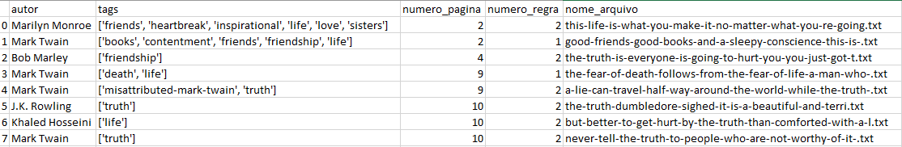

# webCrawler


## Sobre <a name = "about"></a>

O projeto acessa o site http://quotes.toscrape.com e obter todos os quotes que contenham a tag "life" e que sejam do autor "Mark Twain" ou contenham a palavra "truth" no texto do quote, de qualquer autor. Efetuando login e qualquer usuário e senha funciona neste site. Foi criado  um pipeline no scrapy para tratar o armazenamento dos quotes obtidos. O texto dos quotes obtidos são armazenados cada um num arquivo txt separado.
Os seguintes dados sobre os quotes são armazenados em um arquivo CSV, utilizando a biblioteca pandas: autor, tags, número da página, número da regra, nome do arquivo txt correspondente. O CSV é salvo com codificação "utf 8 com BOM" e separado por ";".



## Inicio <a name = "getting_started"></a>

Projeto desenvolvido em Python Versão 3.8

### Pré-requisito

- Execute o comando 
```
 pip install scrapy
```
- Execute o comando 
```
 pip install pip install pypiwin32
```
- Execute o comando 
```
 pip install pip install pandas
```

### Instalação

No diretorio da projeto executar o comando

```
scrapy crawl citacoes
```


